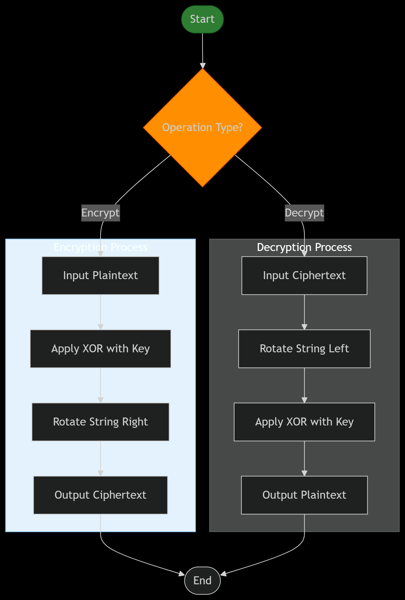

<p align="center">
  
</p>
<br>
<h1 align="center">
  <b>Encryption Algorithm</b>
</h1>
<h3 align="center">

  <b>Level-3 Semester-II</b>  
</h3>
<h3 align="center">
  Course Code: CSE 361 
</h3>

<h3 align="center">
  Course Title: Mathematical Analysis for Computer Science
  
</h3>
<br>
<h3 align="center">
  Submitted by 
</h3>
<h3 align="center">
<b>Khandakar Istiak Muntasir (ID: 2102010) </b> </h3>
<br>
<hr>
<h3 align="center">
  Submitted To 
</h3>

<h3 align="center"><b>Pankaj Bhowmik  </b></h3>
<h3 align="center"><b>Lecturer, Department of CSE</b></h3>
<br>
<hr>
<h3 align="center"> <b>Department of Computer Science and Engineering </b></h3>
<h3 align="center"><b>Hajee Mohammad Danesh Science and Technology University  
Dinajpur-5200</b></h3>
<hr>
<hr>
# <span style="color: #FF6B6B">✧</span><span style="color: #4ECDC4">𝕏𝕆ℝ-ℝ𝕠𝕥𝕒𝕥𝕖 ℂ𝕚𝕡𝕙𝕖𝕣</span><span style="color: #FF6B6B">✧</span>
### <span style="color: #FFD166">⤷ 𝘈 𝘚𝘺𝘮𝘮𝘦𝘵𝘳𝘪𝘤 𝘉𝘪𝘵𝘸𝘪𝘴𝘦 𝘛𝘳𝘢𝘯𝘴𝘧𝘰𝘳𝘮𝘢𝘵𝘪𝘰𝘯 𝘈𝘭𝘨𝘰𝘳𝘪𝘵𝘩𝘮</span>

# XOR Rotate Cipher

A simple implementation of a symmetric encryption-decryption algorithm using XOR operation and string rotation in C++. This algorithm encrypts by applying an XOR with a key and rotating the string right, and decrypts by rotating the string left and applying XOR with the same key.



---

##  Table of Contents

## Table of Contents

- [XOR Rotate Cipher](#xor-rotate-cipher)
 - [Features](#features)
 - [Project Structure](#project-structure)
 - [Algorithm Overview](#algorithm-overview)
 - [Inputs Used in Example](#inputs-used-in-example)
 - [Decryption Process](#decryption-process)
 - [Summary Table](#summary-table)
 - [Build and Run](#build-and-run)
 - [Example Output](#example-output)
 - [Flowchart Description](#flowchart-description)
 - [Source Code](#source-code)


---

##  Features

-  Symmetric Encryption & Decryption
-  XOR operation with a single key
-  Rotation-based string manipulation
-  Simple and understandable implementation
-  Visual flowchart of the logic

---

##  Project Structure
├── main.cpp # Main source code <br>
├── Flow_chart.png # Process flowchart for encryption & decryption<br>
└── README.md # Project documentation<br>

---

##  Algorithm Overview

###  Encryption:
1. XOR each character in the string with the key.
2. Rotate the resulting string **right by 1**.

###  Decryption:
1. Rotate the encrypted string **left by 1**.
2. XOR each character with the same key.

>  XOR is a reversible operation: `A ^ B ^ B = A`

---

##  Inputs Used in Example

| Item        | Value     |
|-------------|-----------|
| Plaintext   | `SHABIT`  |
| Key (int)   | `42`      |
| Key (ASCII) | `*`       |

---

##  Character-by-Character XOR with Numerical Values

Let's break down the XOR step using ASCII values:

| Char | ASCII of Char | Key (42) | XOR Result | XOR Char |
|------|----------------|----------|------------|----------|
| S    | 83             | 42       | 121        | `y`      |
| H    | 72             | 42       | 98         | `b`      |
| A    | 65             | 42       | 107        | `k`      |
| B    | 66             | 42       | 104        | `h`      |
| I    | 73             | 42       | 99         | `c`      |
| T    | 84             | 42       | 126        | `~`      |

**Result after XOR**: `ybkhc~`

---

##  Step 2: Rotate Right by 1 (Encryption)

- Original after XOR: `ybkhc~`
- Rotate right: last character `~` moves to the front

**Encrypted Output**: `~ybkhc`

---

##  Decryption Process

### Step 1: Rotate Left by 1
- Input: `~ybkhc`
- Rotate left: first character `~` moves to the end

**After Rotation**: `ybkhc~`

### Step 2: XOR Again with Key 42

| Char | ASCII of Char | Key (42) | XOR Result | Original Char |
|------|----------------|----------|------------|----------------|
| y    | 121            | 42       | 83         | `S`            |
| b    | 98             | 42       | 72         | `H`            |
| k    | 107            | 42       | 65         | `A`            |
| h    | 104            | 42       | 66         | `B`            |
| c    | 99             | 42       | 73         | `I`            |
| ~    | 126            | 42       | 84         | `T`            |

**Decrypted Output**: `SHABIT` 

---

##  Summary Table

| Step       | Result      |
|------------|-------------|
| Plaintext  | `SHABIT`    |
| XOR Output | `ybkhc~`    |
| Encrypted  | `~ybkhc`    |
| Rotated    | `ybkhc~`    |
| Decrypted  | `SHABIT`    |

---

##  Build and Run

###  Prerequisites
- C++ Compiler (g++, clang++, etc.)

###  Compile and Run

```bash
g++ binary_mystery.cpp -o binary_mystery
./binary_mystery

```
###  Example Output
Original: SHABIT<br>
Encrypted: RJEDKD<br>
Decrypted: SHABIT<br>

###  Flowchart Description

The flowchart `Flow_chart.png` visually represents the steps for both **encryption** and **decryption**.

-  **Green**: Start / End
-  **Orange**: Decision box for operation type (Encrypt / Decrypt)
-  **Blue Section**: Encryption Process (`XOR ➜ Rotate Right ➜ Output`)
-  **Gray Section**: Decryption Process (`Rotate Left ➜ XOR ➜ Output`)

This visualization helps in understanding the order of operations and logic clearly.

###  Source Code

```cpp
#include<bits/stdc++.h>
using namespace std;

string xor_rotate_cipher(const string& text, int key, bool encrypt) {
    string result = text;
    
    // Apply XOR with key to each character
    for (char& c : result) {
        c ^= key;
    }
    
    // Rotate right during encryption, left during decryption
    if (!result.empty()) {
        if (encrypt) {
            // Rotate right by 1
            rotate(result.rbegin(), result.rbegin() + 1, result.rend());
        } else {
            // Rotate left by 1
            rotate(result.begin(), result.begin() + 1, result.end());
        }
    }
    
    return result;
}

int main() {
    string plaintext = "SHABIT";
    int key = 42;
    
    cout << "Original: " << plaintext << endl;
    
    string ciphertext = xor_rotate_cipher(plaintext, key, true);
    cout << "Encrypted: " << ciphertext << endl;
    
    string decrypted = xor_rotate_cipher(ciphertext, key, false);
    cout << "Decrypted: " << decrypted << endl;
    
    return 0;
}
```

